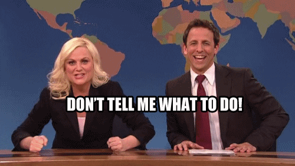

# To-Do App



## Introduction

The To-Do App is a simple, interactive application for managing daily tasks. It allows users to add, view, mark as complete, and delete tasks. Built with HTML, CSS (using Bootstrap), and JavaScript, it offers a responsive and user-friendly interface. The app also uses local storage to persist tasks across browser sessions.

## Features

- Add new tasks to the list.
- View a list of tasks.
- Mark tasks as complete, altering their appearance.
- Delete tasks from the list.
- Persist tasks using local storage.

## Getting Started

To run this application locally, simply clone the repository and open the `index.html` file in a web browser.

### Prerequisites

- Any modern web browser (Google Chrome, Firefox, Safari, etc.)

### Installation

1. **Clone the repository:**

   ```sh
   git clone https://github.com/laplacef/todo_app.git
   ```

2. **Navigate to the project directory:**

   ```sh
   cd todo-list-app
   ```

3. **Open `index.html` in your browser.**

## Usage

To use the app:

1. Enter a task in the input field.
2. Click the 'Add Task' button to add the task to the list.
3. Click 'Complete' to mark a task as completed.
4. Click 'Delete' to remove a task from the list.

## Contributing

Contributions to the To-Do List App are welcome. Feel free to fork the repository and submit a pull request with your changes.

## License

This project is open-source and available under the [MIT License](LICENSE).
